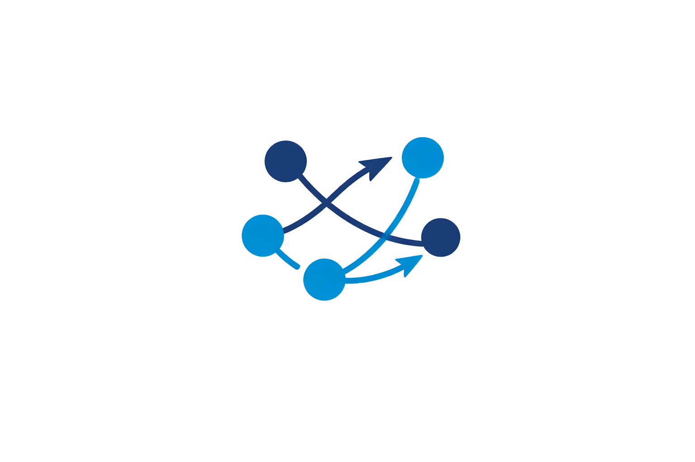
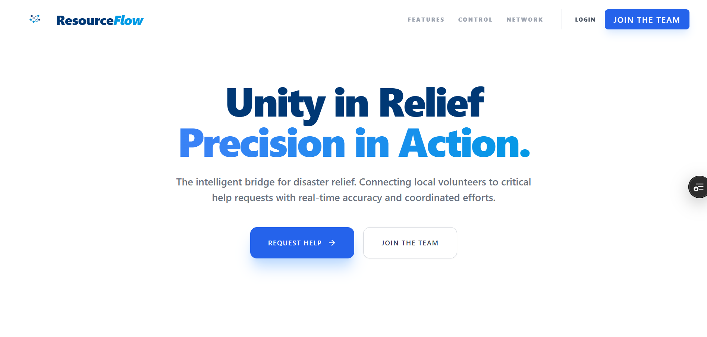
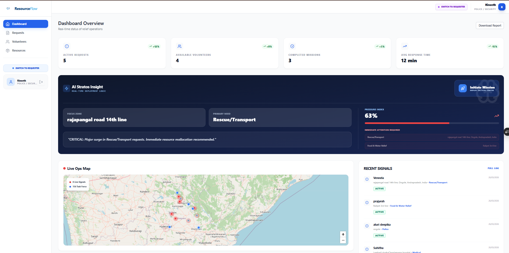
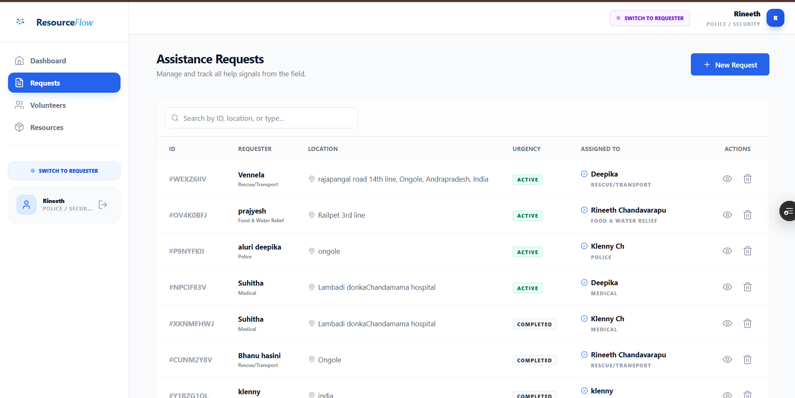

# 🌊 ResourceFlow

<div align="center">
  
  <h1>Unity in Relief, Precision in Action</h1>
  <p><b>The intelligent bridge for disaster relief coordination.</b></p>
  
  <p>
    
    
    
    
  </p>
</div>

---

## 🖼️ Visual Mission Gallery (Quick Look)

| 🌍 Landing Hub (Hero) | 🖥️ Mission Control (Dashboard) |
| :--- | :--- |
|  |  |

| 🛰️ Live Help Signals (Requests) | 🧠 Stratos AI & Intelligence |
| :--- | :--- |
|  |  |

| 📋 Resource Inventory System | 🔐 Secure Authentication |
| :--- | :--- |
|  |  |

| 🤝 Volunteer Assignment | 🌊 System Logo |
| :--- | :--- |
|  |  |

--- 

---

### 📖 What is ResourceFlow?
**ResourceFlow** is an intelligent, real-time platform designed to streamline disaster relief efforts. It connects people in need with local volunteers and resources, ensuring that help reaches the right place at the right time.

> [!IMPORTANT]
> This project was developed for the **Google Solution Challenge 2026** to address humanitarian crises through coordinated, AI-driven action.

### 🧭 "What is What?" — Core Concepts

To make things easy to understand, here’s a breakdown of our terminology:

| 🏷️ Term | 💡 Definition | 🖥️ Role in the App |
| :--- | :--- | :--- |
| **ResourceFlow** | The name of our entire ecosystem. | The platform itself. |
| **Stratos AI** | Our intelligent matching engine. | Found in the `AIChatbot` component. |
| **Mission Control** | The central coordination hub. | The core `Dashboard` page. |
| **Help Signals** | Incoming requests for aid. | Listed in the `Requests` page. |
| **Helping Hands** | Our network of verified volunteers. | Managed in the `Volunteers` page. |
| **Supply Chain** | Inventory of food, water, and medicine. | Tracked in the `Resources` page. |

---

## 🔬 Behind the Scenes: Technical Implementation Breakdown

We didn't just build a dashboard; we built a resilient infrastructure for crisis management. Here is exactly what is happening inside the code:

### 1. 🧠 AI Intelligence Layer
Located in `src/lib/gemini.ts`, this service features a **"Neural Redundancy"** system with a 3-tier fallback loop for high availability in disaster zones:
*   **Tier 1 (Primary)**: Gemini 1.5 Flash for rapid, low-latency coordination.
*   **Tier 2 (Secondary)**: Gemini 1.5 Pro for complex reasoning if Flash hits rate limits.
*   **Tier 3 (Emergency)**: GPT-4o-mini as a "Binary Shield" back-up to ensure aid coordination never stops.
*   **Dynamic Matching**: A semi-stochastic algorithm calculates suitability scores (0-100%) between volunteers and requests based on skills and proximity.

### 2. 🛰️ Mission Control (Real-Time Synch)
Seen in `src/pages/Dashboard.tsx`, the platform uses **Firebase Firestore Snapshots** (`onSnapshot`) to ensure zero-latency updates:
*   **Pressure Index**: An automated calculation that monitors the ratio of urgent requests to available volunteers, visualized as a live "Pressure Indicator."
*   **Tactical Mapping**: Built with Leaflet, the map accurately renders "pings" for new requests and "pulse" animations for active responders.
*   **Personalized Routing**: The dashboard detects the user's role (Needer vs. Responder) and transforms the UI entirely—Shift from "Requesting Help" to "Deploying Missions" dynamically.

### 3. 🔐 Secure Identity Management
Powered by `src/lib/AuthContext.tsx`, our auth flow is more than just login:
*   **Unified State**: Uses a custom `useAuth` hook to bridge Firebase Authentication with persistent Firestore profiles.
*   **Role-Based Access Control (RBAC)**: Gated routes ensure that administrative "Mission Control" tasks are only accessible by verified responders.

### 4. 📦 Modular UI Architecture
The app follows an Atomic Design principle in `src/components`:
*   **Recursive Modals**: High-performance modals like `NewRequestModal.tsx` handle complex state transitions (from request entry to AI verification) without page reloads.
*   **Lucide-React Visuals**: Every icon is carefully chosen for clarity in high-stress environments, with TailwindCSS providing responsive "premium-feel" aesthetics.

---


---

## 🛠️ Project Structure ("Where is What?")

If you are looking for specific code, here is a quick map of the repository (all folders are at the root `/` level):

```bash
/
├── 📂 public/              # Mission assets (Tactical icons and images)
├── 📂 src/
│   ├── 📂 components/      # Atomic UI parts (Modals, Buttons, Status Badges)
│   │   ├── 📂 Layout/      # Dashboard and Page wrappers
│   │   └── 📂 UI/          # Standalone UI elements
│   ├── 📂 lib/             # Stratos AI (Gemini) & Firebase Core logic
│   └── 📂 pages/           # Mission Control hubs (Dashboard, Live Requests)
├── 📄 package.json          # Project dependencies & scripts
├── 📄 tailwind.config.js    # Design system configuration
└── 📄 README.md             # This document
```

---

## 🚀 Key Features at a Glance

*   **⚡ Smart Matching**: Uses **Stratos AI** to link the closest available volunteer to a request based on skill sets (Medical, Rescue, Food).
*   **📍 Live Mapping**: Interactively visualize help requests and volunteer locations on a unified map.
*   **📊 Crisis Insights**: Real-time analytics to identify disaster hotspots and predict resource needs.
*   **🛡️ Verified Rescue**: A secure onboarding process for volunteers to ensure community safety.

---

## 🛠️ How to Run This Locally

Getting started is as easy as:

1. **Clone**: `git clone <your-repo-link>`
2. **Install**: `npm install`
3. **Run**: `npm run dev`
4. **Visit**: [ResourceFlow](https://resourceflow0.vercel.app/)

---

## 🏗️ Tech Stack Deep-Dive

| Category | Technology | Use Case |
| :--- | :--- | :--- |
| **Frontend** | React 18 (TS) | High-performance state management & UI consistency. |
| **Backend** | Firebase | Real-time Firestore listeners for instant relief tracking. |
| **AI** | Google Gemini | **Stratos AI** core for matching volunteers to requests. |
| **Styling** | TailwindCSS | Premium, responsive aesthetics across all devices. |
| **Mapping** | Leaflet / Google | Tactical visual awareness on a global scale. |

---

## 🤝 Contribution & License

This project is a core submission for the **Google Solution Challenge 2026**.

*   **Feedback**: We welcome feedback on our AI matching logic and disaster response workflow.
*   **Issues**: Found a bug in the Mission Control panel? Open an issue!
*   **License**: MIT Licensed.

---

## 🙏 Thank you for visiting!

We appreciate you taking the time to explore **ResourceFlow**. If you have any feedback or would like to collaborate, feel free to reach out!

**Built with ❤️, Team ResourceFlow**

---

<p align="center">
  <i>Making a difference, one signal at a time.</i>
</p>
